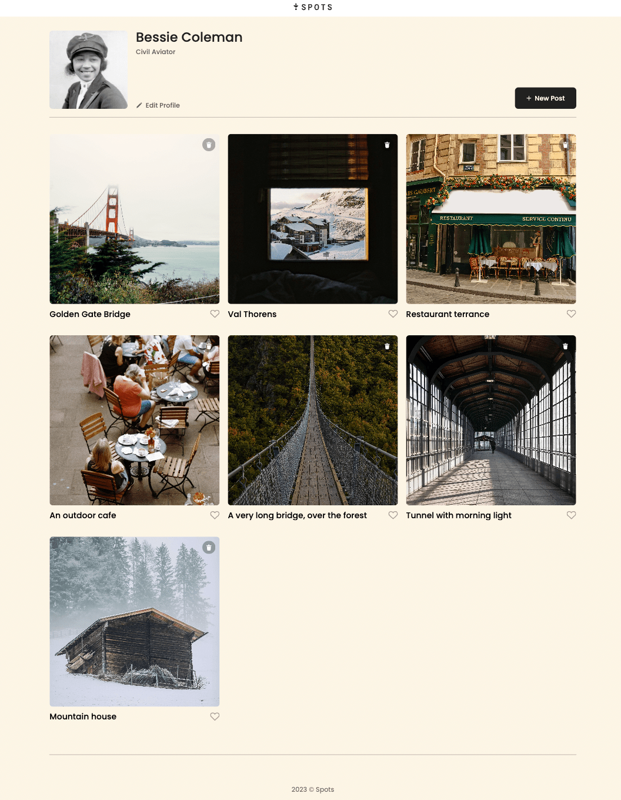
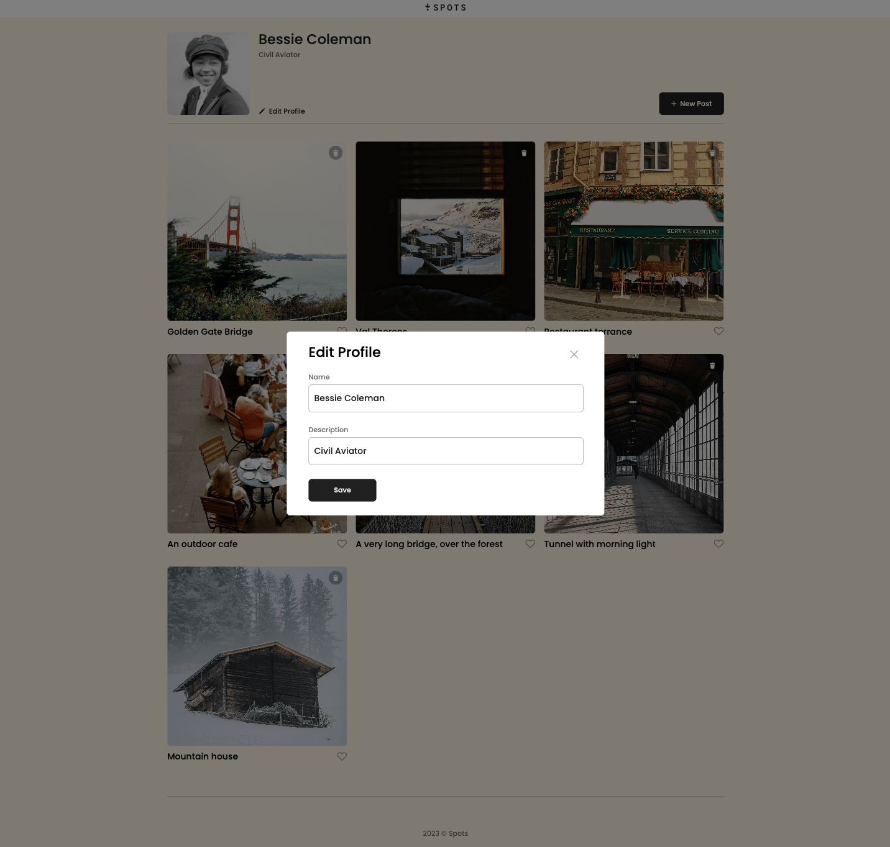
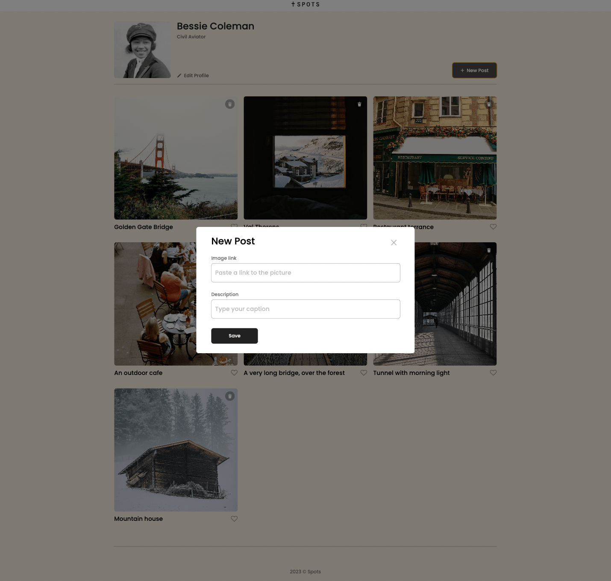
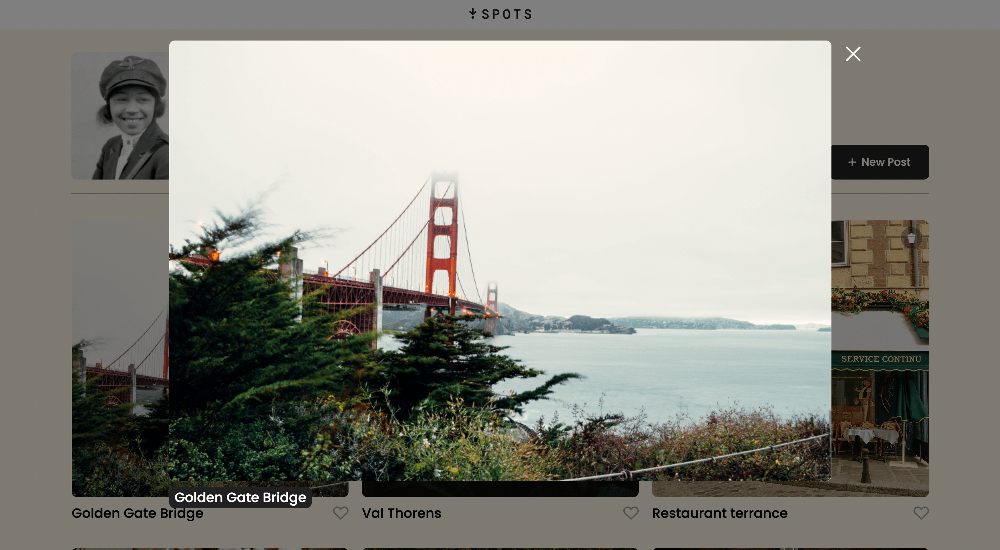
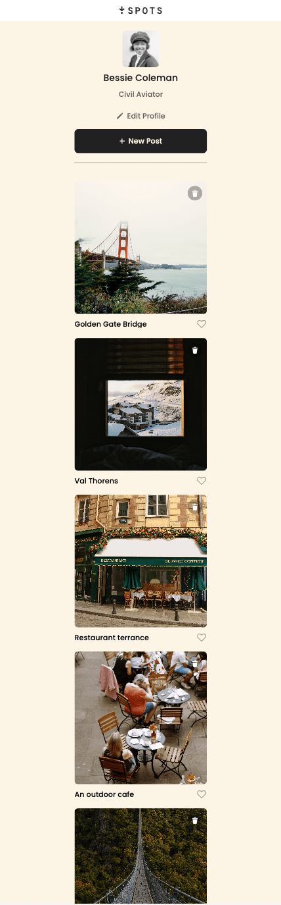
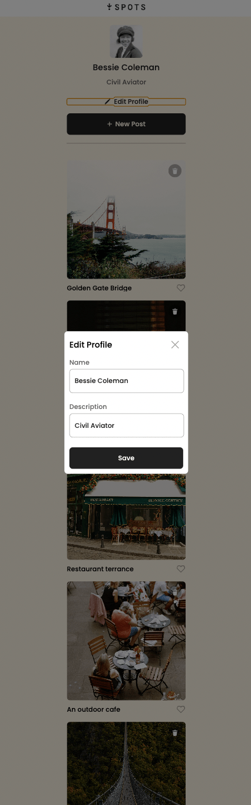
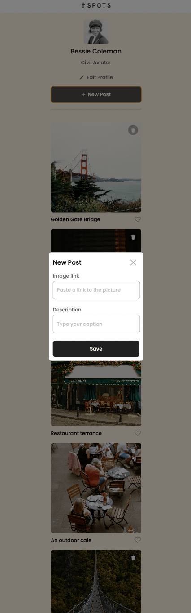
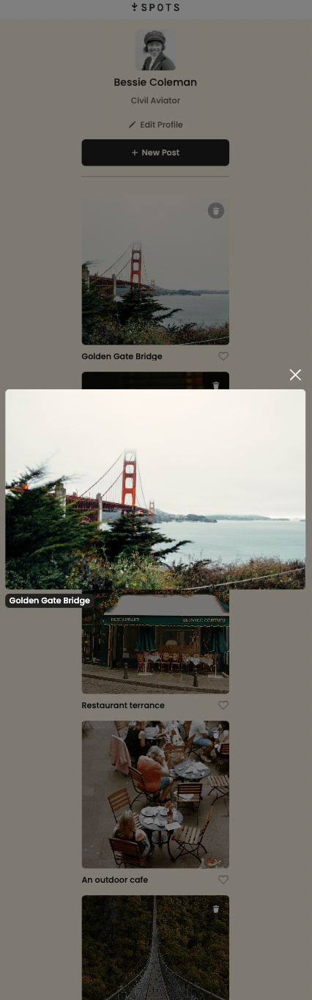

# Spots

**Spots** is an interactive social media web application that allows users to create, view, and interact with visual content. Unlike earlier iterations, the app is now fully connected to a remote database via an API, so user changes (profile info, cards, likes, avatar updates) **persist even after a page reload**.

**Video Walkthrough:** [Spots Demo](https://drive.google.com/file/d/1VKplpPnGAeka4lVnJNJ8yTNz6WsEnAqR/view?usp=sharing)

---

## Project Description

Spots is designed to simulate a basic user interface experience for a social photo-sharing platform. Users can:

- View a gallery of posts fetched from the API
- Preview a larger version of post
- Like/unlike posts (likes update in real time)
- Add new posts that persist to the server
- Delete their own posts with confirmation
- Edit their user profile (Ex: name or description)
- Update their avatar
- Experience smooth transitions and responsive design elements

---

## Technologies & Techniques Used

- **HTML5**: Semantic structure of the application
- **CSS3**: Styling, responsive layout, and transitions
- **JavaScript (ES6+)**: DOM manipulation, event handling, and dynamic modal functionality
- **Fetch API**: To communicate with the server
- **Webpack**: Bundling, asset optimization, ES6 modules
- **Babel**: Ensure compatibility across browsers
- **Flexbox**: For flexible, responsive layout
- **SVG icons**: For scalable, sharp user interface icons (pencil, plus, like)
- **BEM Methodology**: Clean and modular CSS naming convention
- **Media Queries** : For responsiveness across devices

---

## API Integration

The app is connected to the **TripleTen Spots API**:  
`https://around-api.en.tripleten-services.com/v1`

### API Features Implemented:

- **GET /users/me** → Load current user profile
- **PATCH /users/me** → Edit profile info
- **PATCH /users/me/avatar** → Update avatar
- **GET /cards** → Load initial cards from server
- **POST /cards** → Add a new card
- **DELETE /cards/:cardId** → Delete a card
- **PUT /cards/:cardId/likes** → Like a card
- **DELETE /cards/:cardId/likes** → Remove a like

> All API requests are encapsulated in an `Api` class (`utils/Api.js`) for clean, reusable calls.

---

## Screenshots

### Desktop View

### Mobile View

---

## Design Prototype

Spots was built iteratively across multiple sprints, each introducing new features.:

- **Sprint 3** – Responsive layout, intermediate breakpoints, overflow handling, hover states, deployment, README, and demo video

  - 🎨 [Figma Sprint 3 Design](https://www.figma.com/design/BBNm2bC3lj8QQMHlnqRsga/Sprint-3-Project--Spots?node-id=0-1&p=f)

- **Sprint 4** – Profile form prefill, Edit Profile submission, New Post submission (log only), smooth modal transitions
  - 🎨 [Figma Sprint 4 Design](https://www.figma.com/design/rGnA0eBcxYVOpA4bxmqlyu/Sprint-4-Project-Spots---March-2025?node-id=0-1&p=f)
- **Sprint 5** – Card template generation, “New Post” submit (prepend), like toggle, delete card, and image preview modal
  - 🎨 [Figma Sprint 5 Design](https://www.figma.com/design/p7amENvGmugKHfrOif5p1E/Sprint-5-Project-Spots---March-2025?node-id=51-138&p=f)
- **Sprint 6** – Form validation module, reset behavior, and modal UX (overlay + Escape to close)
  - 🎨 [Figma Sprint 6 Design](https://www.figma.com/design/jFtXsDr4XOyebKcgjyXN6W/Sprint-6-Project--Spots?node-id=51-138&p=f)
- **Sprint 9 (Final – API Integration)** – Connect to backend API with persistent user/cards/likes/avatar; loading states; delete confirmation; branch + PR submission
  - 🎨 [Figma Sprint 9 Design](https://www.figma.com/design/mXGZ6wZ4QPKx5KjpHX9QCV/Sprint-9-Project--Spots?node-id=0-1&p=f)

---

## Live Demo

You can view the deployed project here:  
[Spots on GitHub Pages](https://joyce1312.github.io/se_project_spots/)

---

## Author

By **Joyce Yeung**
