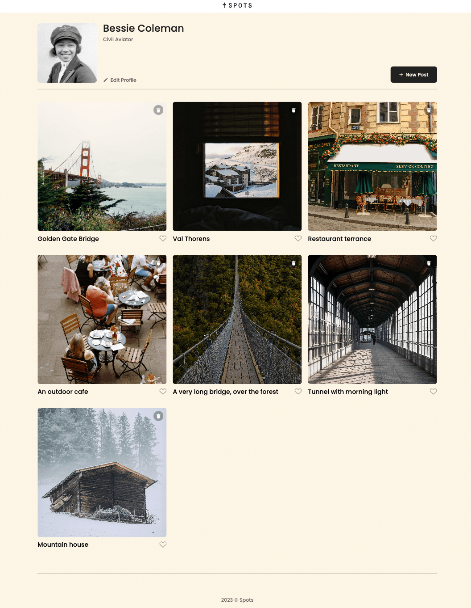
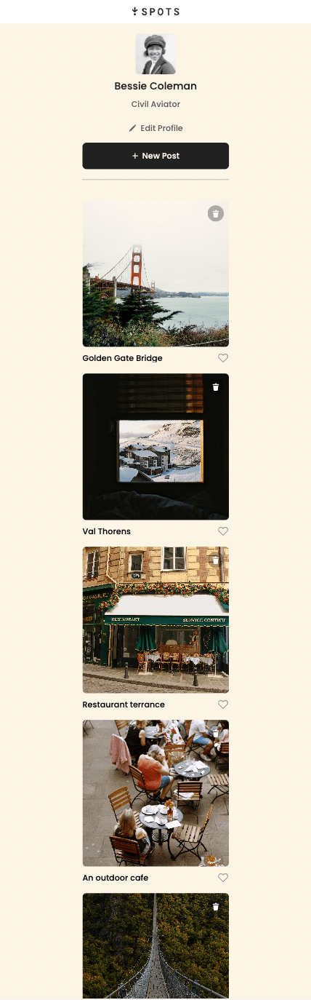

# Spots

**Spots** is an interactive social media web application that allows users to create, view, and interact with visual content. Users can upload new photos, remove existing ones, like posts from other users, and make small adjustments to their profile.

**Video Walkthrough:** [Spots Demo](https://drive.google.com/file/d/1VKplpPnGAeka4lVnJNJ8yTNz6WsEnAqR/view?usp=sharing)

---

## Project Description

Spots is designed to simulate a basic user interface experience for a social photo-sharing platform. Users can:

- View a gallery of beautiful scenic photographs
- Preview a larger version of post
- Like images using a custom SVG button
- Add new posts with the “New Post” button
- Edit their user profile (Ex: name or description)
- Experience smooth transitions and responsive design elements

---

## Technologies & Techniques Used

- **HTML5**: Semantic structure of the application
- **CSS3**: Styling, responsive layout, and transitions
- **JavaScript (ES6+)**:DOM manipulation, event handling, and dynamic modal functionality
- **Flexbox**: For flexible, responsive layout
- **SVG icons**: For scalable, sharp user interface icons (pencil, plus, like)
- **BEM Methodology**: Clean and modular CSS naming convention
- **Media Queries** : For responsiveness across devices

---

## Screenshots

### Homepage Desktop View

### Homepage Mobile View

---

## Design Prototype

This project was built based on a Figma design. You can view the original prototype here:
[View the Figma Design](https://www.figma.com/design/p7amENvGmugKHfrOif5p1E/Sprint-5-Project-Spots---March-2025?node-id=51-138&p=f&t=kYtKCMHxjHFEWwux-0)

---

## Live Demo

You can view the deployed project here:  
[Spots on GitHub Pages](https://joyce1312.github.io/se_project_spots/)

---

## Author

By **Joyce Yeung**
